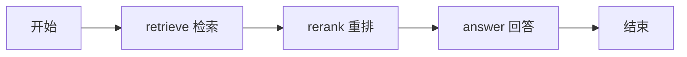

# 第五课 · 5.1：用 LangGraph 连接流程

**LangGraph 负责组织步骤：先检索，再重排，最后回答。**

前面写好的检索和模型调用继续使用。本节是执行顺序固定的 RAG 工作流；下一小节再学习按条件选择下一步。



## 1. 安装本课

本课新增 `langgraph` 依赖，已锁定并验证 1.2.14。新文件在 C 盘工作区，用下面的命令安装到 E 盘：

```powershell
Set-Location -LiteralPath 'E:\agent Perfect form\knowledge-agent'
uv run python 'C:\Users\Zwb\Documents\Codex\2026-10-06\n-h-2\outputs\knowledge-agent\install_lesson05a.py'
uv sync --locked
uv run python lesson05a.py --check
```

安装程序复制本课代码、讲义和依赖文件，沿用现有 `.env`，不需要新密钥。依赖文件若已有其他修改，会停止并提示，避免覆盖。

`--check` 检查图能否组装、配置、知识块和索引；不调用云 API。

## 2. 跑一次完整问答

```powershell
uv run python lesson05a.py "试算平衡能发现所有记账错误吗？" --show-context
```

终端会依次显示：

```text
[1/3 retrieve] 向量检索 + BM25 + RRF……
    更新 State.candidates：最多 6 块候选资料
[2/3 rerank] 重排模型给候选原文打分……
    更新 State.selected：最多 3 块最终资料
[3/3 answer] Qwen3 根据最终资料回答……
```

实际输出会显示具体块数，随后是带 `[1]` 等引用的回答。这里应回答“不能”，并找到“会计分录 & 试算平衡”的原文。

正常问答仍调用一次问题 Embedding、一次 Rerank、一次聊天模型，按现有服务计费；BM25 和 RRF 在本地计算。已有笔记向量继续复用，LangGraph 本身没有新增模型调用。

## 3. 先认识三个概念

| 概念 | 通俗解释 | 本课对应什么 |
| --- | --- | --- |
| Node（节点） | 做一件事的 Python 函数 | `retrieve`、`rerank`、`answer` |
| Edge（边） | 指定做完后走哪一步 | 检索 → 重排 → 回答 |
| State（状态） | 本次问答的记录表，节点从中取数据并写入结果 | 问题、候选资料、最终资料、答案 |

State 在运行过程中逐步补全：

| 运行到哪里 | 新写入的字段 |
| --- | --- |
| 开始 | `question`：用户问题 |
| 检索完成 | `candidates`：最多 6 块 |
| 重排完成 | `selected`：最多 3 块 |
| 回答完成 | `answer_text`：最终答案 |

例如检索节点只返回：

```python
return {"candidates": candidates}
```

这表示“更新 candidates 这一栏”，不会把整份 State 替换掉。之前的 `question` 会保留，所以重排节点还能读到用户问题。本课同一个字段再次被更新时，新值会替换旧值。

**本课的 State 只用于这次问答。** 再次运行命令会开始新的 State；跨轮对话记忆留到第六课学习。

## 4. 代码先看这几处

打开 `lesson05a.py`，依次看：

1. `AgentState`：规定这张记录表有哪些栏。`total=False` 允许开始时只填问题，其他栏由后续节点填写。
2. `retrieve()`、`rerank()`、`answer()`：三个节点分别读什么、返回什么。
3. `build_graph()`：登记节点、连接顺序。
4. `graph.invoke(...)`：真正启动一次问答，返回最终 State。

关键连接代码：

```python
builder.add_edge(START, "retrieve")
builder.add_edge("retrieve", "rerank")
builder.add_edge("rerank", "answer")
builder.add_edge("answer", END)
```

`START` 和 `END` 表示流程入口、出口。执行顺序由这些边决定，与三个函数在文件里谁写在前面无关。

`compile()` 把节点和边组装成可执行的图；`invoke()` 才开始运行节点。只想查看图的 Mermaid 文本，可以运行 `uv run python lesson05a.py --graph`，无需读取 `.env` 或调用模型。

代码中的 `Services` 保存共用的模型连接和资料，`runtime.context` 让节点取到它们。本节先照着使用即可，重点掌握 State、节点和边。

## 5. 这一节学到了什么

LangGraph 不会自动提高检索准确率，也不会自动决定下一步。本课的顺序是我们用边明确规定的。以后加入“资料不足怎么办”“什么时候调用工具”，就能继续在图里增加节点和条件。

节点发生错误时，本课会停止，并显示错误类别或可读提示；不会把失败当作成功继续回答。没有候选资料时，会直接说明资料不足。引用检查只能检查格式和编号，仍需结合原文判断答案是否正确。

运行后回答两个问题：

1. 检索节点只返回 `candidates`，为什么后面的节点还能读到 `question`？
2. `compile()` 和 `invoke()`，哪一个会真正开始执行检索和模型调用？

官方参考：[LangGraph Graph API](https://docs.langchain.com/oss/python/langgraph/graph-api)。WeKnora 用于借鉴检索设计，本课的 Python 工作流使用 LangGraph。
