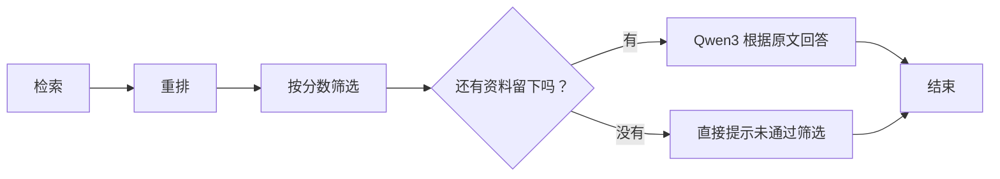

# 第五课 · 5.2：用条件边选择下一步

**上一节固定走向回答；这一节先筛选资料，再决定是否进入回答节点。**



图里的菱形对应路由函数，它负责决定下一站。

## 1. 安装，再看离线演示

本课没有新依赖或配置。文件暂存在 C 盘，执行：

```powershell
Set-Location -LiteralPath 'E:\agent Perfect form\knowledge-agent'
uv run python 'C:\Users\Zwb\Documents\Codex\2026-10-06\n-h-2\outputs\knowledge-agent\install_lesson05b.py'
uv run python lesson05b.py --demo
```

演示中的分数是人为设置的，回答也是模拟的，不会读取你的笔记或调用模型：

- 分数 `0.8`，达到默认门槛 `0.5` → 进入 `answer`。
- 分数 `0.2`，低于门槛 → 进入 `insufficient`。

也可以运行 `uv run python lesson05b.py --demo --min-score 0.9`，观察两组资料此时会走哪条路线。

## 2. 用自己的笔记运行

```powershell
uv run python lesson05b.py --check
uv run python lesson05b.py "试算平衡能发现所有记账错误吗？" --show-context
uv run python lesson05b.py "明天上海会下雨吗？"
```

这两个问题已用你的会计笔记实测：第一个保留了相关片段，进入回答节点并引用 `[1]`；第二个的候选分数都很低，进入提示节点，没有调用聊天模型。实际模型分数可能变化，以终端日志为准。

`--check` 只检查本地。真实问答会调用问题 Embedding 和 Rerank；进入 `answer` 后才调用 Qwen3 聊天模型，费用沿用现有服务规则。笔记向量继续复用。

## 3. 新增的三个函数

先读 `lesson05b.py` 的这三处：

| 函数 | 做什么 |
| --- | --- |
| `filter_selected()` | 保留重排分数大于或等于门槛的资料，更新 State 的 `selected` |
| `choose_next()` | 读取更新后的 `selected`，返回下一站的名字 |
| `insufficient()` | 直接生成一段提示，不调用聊天模型 |

筛选节点返回：

```python
return {"selected": selected}
```

这会用筛选后的资料替换原来的 `selected`。`question` 等其他字段仍保留，正好对应上一节的 State 更新规则。

路由的核心逻辑只有几行：

```python
if state["selected"]:
    return "answer"
return "insufficient"
```

非空列表表示还有资料，空列表表示没有资料留下。**路由函数返回的是下一站名称，不是给用户的答案，也不是 State 更新。**

## 4. 把判断接到图里

```python
builder.add_conditional_edges("filter", choose_next, {
    "answer": "answer",
    "insufficient": "insufficient",
})
```

含义是：`filter` 执行完，LangGraph 把更新后的 State 交给 `choose_next`，再按返回值选择节点。这里的判断来自我们写的 Python 条件，LangGraph 负责按选择执行。

普通的 `add_edge` 表示“固定去这里”；`add_conditional_edges` 表示“先判断，再选下一站”。不要在 `filter` 后同时加一条直达 `answer` 的普通边，否则两条路径都可能执行。

运行 `uv run python lesson05b.py --graph` 可以查看实际流程图的 Mermaid 文本。

## 5. 门槛该怎么理解

`0.5` 是本课用于练习分支的起始值，**不是 50% 正确率，也不是所有重排模型通用的标准**。后续要用自己整理的问题和正确资料来调整它：设得太高可能丢掉有用资料，太低可能放进无关资料。

向量检索经常能返回“最接近”的几块，即使它们并不能回答问题，所以这里判断的是**筛选后是否有资料留下**。通过筛选只是允许尝试回答，Qwen3 仍需按原文作答，资料不足时仍应说明。

没有资料通过门槛，也不能证明整个知识库没有答案，可能是没检索到，或门槛不合适。接口出错则会报错停止，不会冒充“资料不足”。

运行后回答：

1. `choose_next()` 返回 `"insufficient"` 后，`answer` 节点还会执行吗？
2. `filter_selected()` 和 `choose_next()`，谁负责更新 State，谁负责选择下一步？

官方参考：[LangGraph 条件边](https://docs.langchain.com/oss/python/langgraph/graph-api#conditional-edges)。
