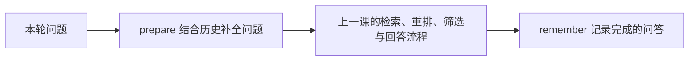

# 第六课 · 6.1：记住同一会话的上下文

这一节让程序能接着聊：

```text
你：试算平衡能发现所有记账错误吗？
助手：不能……
你：那它查不出来哪些错误？
```

程序先结合历史，把第二句补成“试算平衡不能发现哪些记账错误？”，然后重新查笔记回答。

**6.1 先用内存记忆，退出程序就会清空；6.2 再接 Redis，学习重启后恢复。** 本课没有新依赖或密钥。

## 1. 安装，先看离线演示

文件暂存在 C 盘工作区，执行以下命令安装到 E 盘：

```powershell
Set-Location -LiteralPath 'E:\agent Perfect form\knowledge-agent'
uv run python 'C:\Users\Zwb\Documents\Codex\2026-10-06\n-h-2\outputs\knowledge-agent\install_lesson06a.py'
uv run python lesson06a.py --demo
```

演示中的检索、问题补全和回答都是模拟的，不读取笔记或调用模型，但会实际运行 LangGraph 的记忆功能。观察：

1. `study` 第一轮显示历史 0 轮，第二轮显示 1 轮。
2. 换成 `other`，历史又是 0 轮。
3. 换一个全新的内存保存器，原来的 `study` 也没有记录。

## 2. 开始真实连续对话

```powershell
uv run python lesson06a.py --check
uv run python lesson06a.py --session study
```

看到 `[study] 你：` 后，依次输入下面两句。**每句等回答完成后再输入下一句，不要每问一次都重新运行 Python。**

```text
试算平衡能发现所有记账错误吗？
那它查不出来哪些错误？
```

两轮已实测通过。第二轮会显示“本轮检索问题”，用它检查模型是否理解了追问。回答中的 `[1]` 等引用，仍来自本轮重新找到的原文。

继续在同一个对话程序里输入：

```text
/history
/session other
/history
/session study
/history
/quit
```

| 命令 | 作用 |
| --- | --- |
| `/history` | 查看当前会话最近完成的问答 |
| `/session other` | 切换到编号为 other 的会话 |
| `/session study` | 切回 study 会话 |
| `/quit` | 退出程序，本次内存记忆随之清空 |

`study` 和 `other` 是自己起的会话编号，没有特殊含义。新会话没有上文，提问时应把话题说完整。

## 3. 新增了什么



| 名称 | 通俗理解 |
| --- | --- |
| `InMemorySaver` | 在当前程序的内存里保存流程状态 |
| `thread_id` | 会话编号，决定读取哪份记录 |
| `history` | State 中由我们维护的近期问答列表 |

模型不会因为上次调用过，就自动记得你说了什么。是程序保存了历史，并在需要时重新把它发给模型。

本课历史仅用于理解追问。真正生成答案时，依然使用**本轮补全后的问题 + 本轮检索出的资料**，不把旧回答当作新的笔记依据。

## 4. 代码先看四处

打开 `lesson06a.py`：

1. `prepare()`：读取 `user_question` 和当前会话的 `history`，写出用于检索的 `question`。
2. `remember()`：把完成的这一轮放入 `history`。
3. `build_graph()`：编译时接上保存器。
4. `invoke_turn()`：调用图时提供会话编号，清空上一轮临时结果，保留恢复的历史。

保存器接在这里：

```python
memory = InMemorySaver()
graph = builder.compile(checkpointer=memory)
```

调用时带上编号：

```python
config = {"configurable": {"thread_id": "study"}}
result = graph.invoke(inputs, config=config, context=services)
```

本课让同一个图共用一个保存器，依靠编号读取对应记录。程序把图建在对话循环外面，每轮只调用 `invoke()`；每问一次都重新创建内存保存器，就会丢掉之前的记录。

`history` 仍采用你学过的字段替换规则：代码先把旧记录和新一轮合在一起，取最后 3 轮，再返回整个新列表替换 `history`。本轮输入不传 `history`，因此不会把恢复的历史覆盖为空。

**“最近 3 轮”指本课交给问题补全模型的历史窗口。** 保存器还可能保留更早的流程快照，不能理解成所有旧数据都已删除。

## 5. 记住三个边界

- **每轮重新检索。** 复用的是笔记向量，不是上一轮选出的知识块；引用也会重新编号。
- **有历史时多一次模型调用。** 首轮沿用上一课的调用流程；后续先用 Qwen3 补全问题，再做 Embedding、Rerank，资料通过筛选后再生成回答。按现有服务计费，改写结果仍要看日志核对。
- **记忆尚未写入 Redis。** 即使重新运行时仍填 `--session study`，旧记录也回不来，因为本节的保存器只在原进程中。

节点出错的轮次不会追加到 `history`；程序会保留当前会话并继续等待新输入。检查点可能包含出错轮次的中间状态，因此 `/history` 只展示我们明确记录的完整问答。资料未通过筛选时的正常提示，也会作为一轮完成的对话记录。

运行后回答两个问题：

1. 为什么切换 `thread_id` 后，不能直接使用另一个会话的历史？
2. 第二轮已经有历史了，为什么还要重新检索笔记？

官方参考：[LangGraph 会话保存](https://docs.langchain.com/oss/python/langgraph/persistence)。
